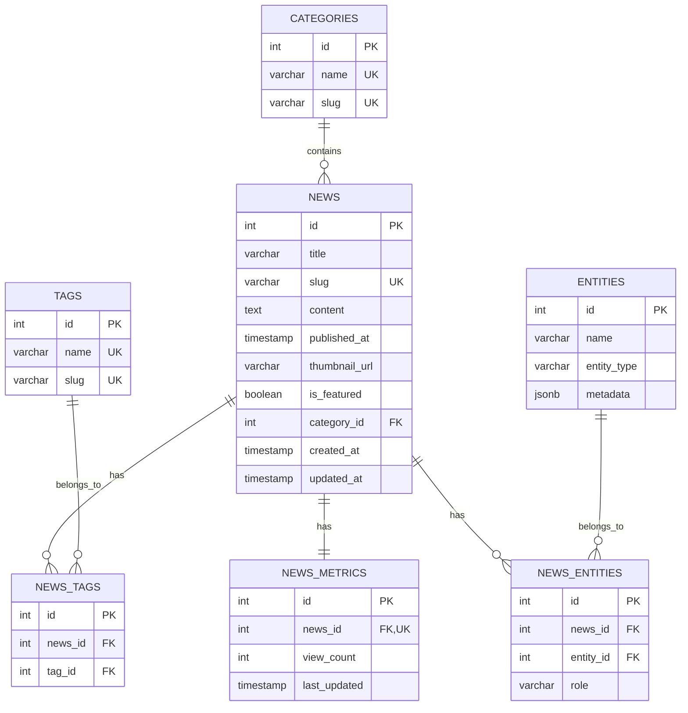

```mermaid

erDiagram
    NEWS {
        int id PK
        varchar title
        varchar slug UK
        text content
        timestamp published_at
        varchar thumbnail_url
        boolean is_featured
        int category_id FK
        timestamp created_at
        timestamp updated_at
    }
    
    CATEGORIES {
        int id PK
        varchar name UK
        varchar slug UK
    }
    
    TAGS {
        int id PK
        varchar name UK
        varchar slug UK
    }
    
    NEWS_TAGS {
        int id PK
        int news_id FK
        int tag_id FK
    }
    
    NEWS_METRICS {
        int id PK
        int news_id FK,UK
        int view_count
        timestamp last_updated
    }
    
    ENTITIES {
        int id PK
        varchar name
        varchar entity_type
        jsonb metadata
    }
    
    NEWS_ENTITIES {
        int id PK
        int news_id FK
        int entity_id FK
        varchar role
    }
    
    NEWS ||--o{ NEWS_TAGS : "has"
    TAGS ||--o{ NEWS_TAGS : "belongs_to"
    
    NEWS ||--|| NEWS_METRICS : "has"
    
    CATEGORIES ||--o{ NEWS : "contains"
    
    NEWS ||--o{ NEWS_ENTITIES : "has"
    ENTITIES ||--o{ NEWS_ENTITIES : "belongs_to"
```